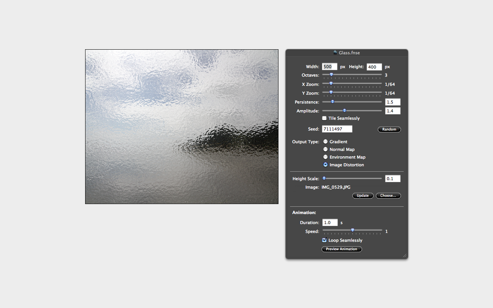

## Usage and History

I discontinued support for Fluid Noise Generator a while back, and have decided to make it open source. 

I am not maintaining or supporting this code, but have just put it out there in case anyone finds it useful. It compiles for macOS High Sierra 10.13 as of the beginning of 2018, and appears to be working, however the UI is looking a bit ugly.

The animation/movie exporting has been commented out as this required the old verison of Quicktime which is no longer supported by Apple. You might be able to get it working again relatively easily by linking against an old macOS SDK. OpenEXR support has also been disabled for similar reasons.

## Description

Fluid Noise Generator is a simple fractal noise generator, which can generate tiling looping images and movies from scratch, using Perlin noise to create reliable and repeatable results.

Common Uses:
- Height maps and matching textures for terrain generation in games or 3D modeling
- Create tiling background images for web sites
- Create animations for use in movies.
- Animated noise texture creation for use when making games, or as an input to GLSL shaders or 3D applications
- A powerful substitute for noise generators in compositing or image creation applications

Features:
- Export 8 bit or 32 bit seamless tiling images
- Export animated seamless tiling, looping image sequences or movies
- Uses all available CPU cores to deliver fast responsive editing
- Supports drag and drop, undo / redo and saving of parameters for later use
- Can export normal maps in 8 bit or 32 bit floating point TIFF or OpenEXR.
